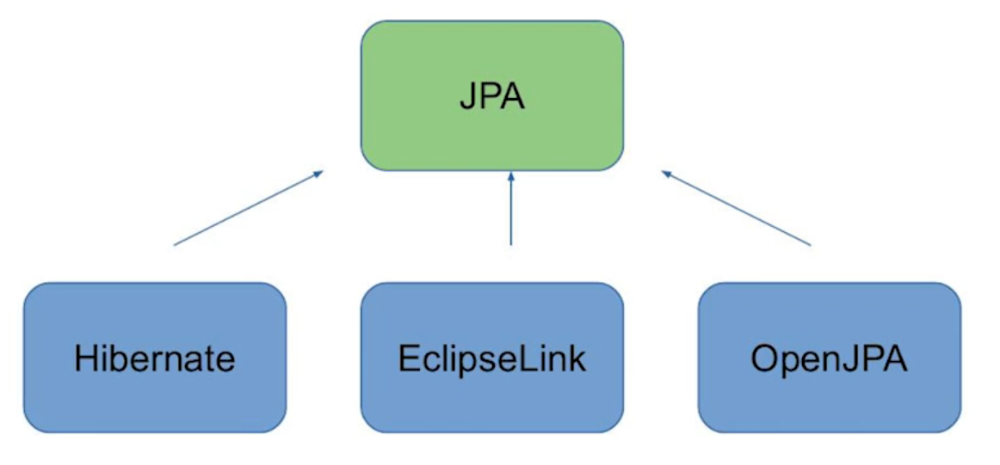
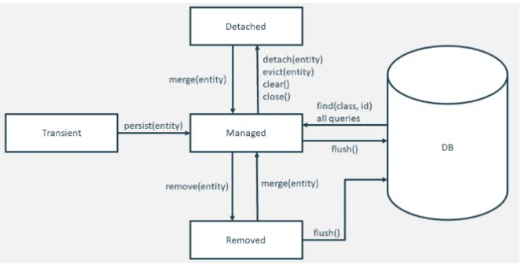

# Persistencia con JPA: Hibernate
## Hibernate

- Creado en 2001 por Gaving King
- Alternativa a JDBC /EJB 2
- Posteriormente Gaving King fue contratado por Red Hat

## JPA

- Especificacion para ORM (Object Relational Mapping) en Java
- Lanzada en 2006
- Version 2.0 lanzada en 2009
- Hibernate 3.5.0 (2010) paso a soportar JPA 2

## Ciclo de vida en JPA

Estados de una Transaccion:
- Transiente
- Managed
- Detached
- Removed