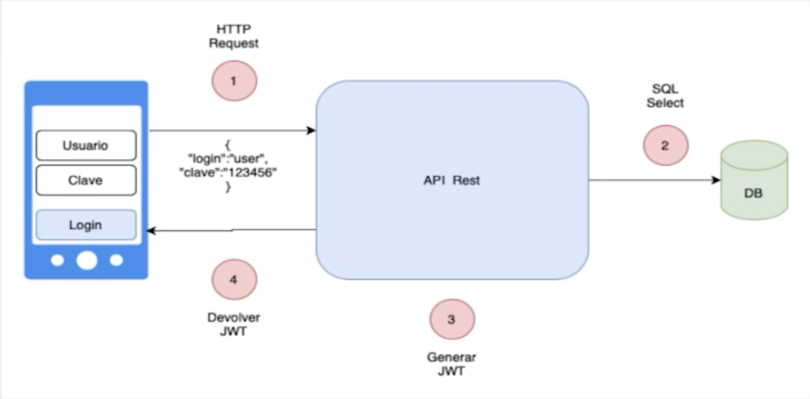
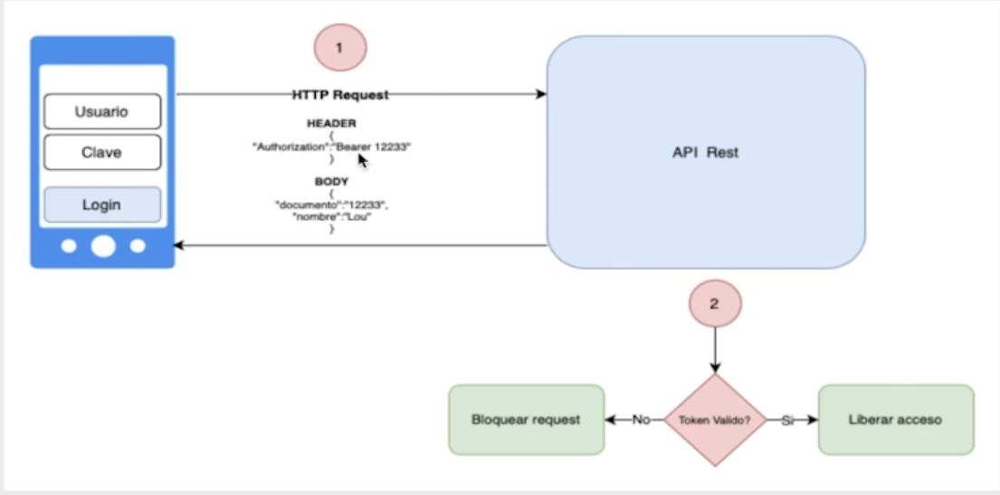
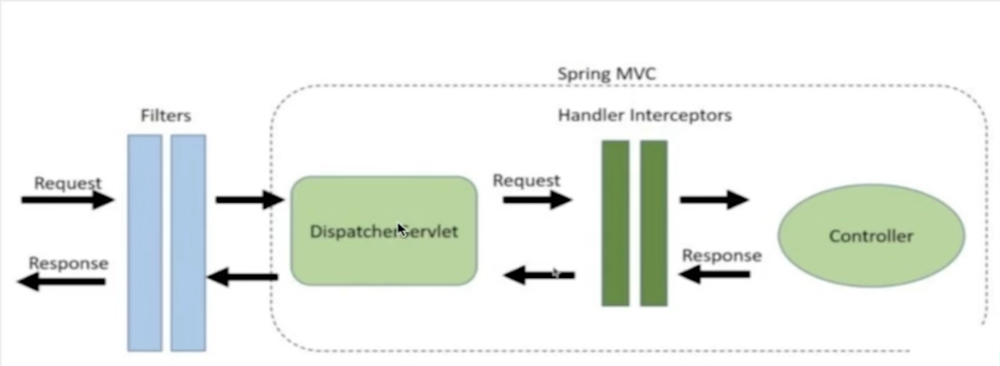

# Spring Boot 3 : Aplique las mejores prácticas y proteja una API REST

## Objetivos
- Buenas Practicas en API
- Tratamiento de errores
- Autenticación y Autorización
- Tokens JWT

## Spring Security
### Objetivos
- Autenticación
- Autorización
- Protección contra ataques(CSRF, clickjacking)

### Autenticación

### Autorización

#### Filters

